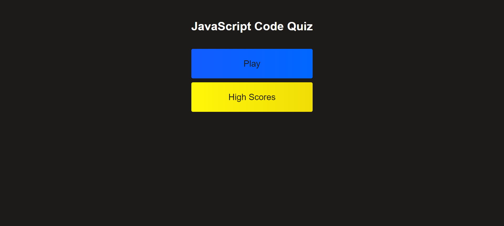

# CODE QUIZ

## CONTENTS OF THIS FILE

* Introduction
* How to Use
* User Story
* Acceptance Criteria
* Access
* Contribution
* Acknowledgement

## INTRODUCTION

UConn Bootcamp Weekly Challenge 4: Code Quiz   
Build a timed coding quiz with multiple-choice questions. This app will run in the browser, and will feature dynamically updated HTML and CSS powered by JavaScript code. 
 
Built With:
- HTML
- CSS
- JavaScript

## HOW TO USE

- Go to the webpage https://paperpatch.github.io/weekly-challenge-4/
- Click on `Play` to start the game.
- You have 30 seconds to answer 4 basic JavaScript questions. Each 'correct' answers gives you 100 points. Each 'incorrect' answers loses 5 seconds on the timer.
- Enjoy the game.

 

## USER STORY
AS A coding boot camp student  
I WANT to take a timed quiz on JavaScript fundamentals that stores high scores  
SO THAT I can gauge my progress compared to my peers  

## ACCEPTANCE CRITERIA

GIVEN I am taking a code quiz  
WHEN I click the start button  
THEN a timer starts and I am presented with a question  
WHEN I answer a question  
THEN I am presented with another question  
WHEN I answer a question incorrectly  
THEN time is subtracted from the clock  
WHEN all questions are answered or the timer reaches 0  
THEN the game is over  
WHEN the game is over  
THEN I can save my initials and score  

## ACCESS
https://paperpatch.github.io/weekly-challenge-4/

Version edits and changes can be found in Github commit changes at https://github.com/paperpatch/weekly-challenge-4/

## CONTRIBUTION
Made by Patrick Chen

## ACKNOWLEDGEMENT
UConn Bootcamp